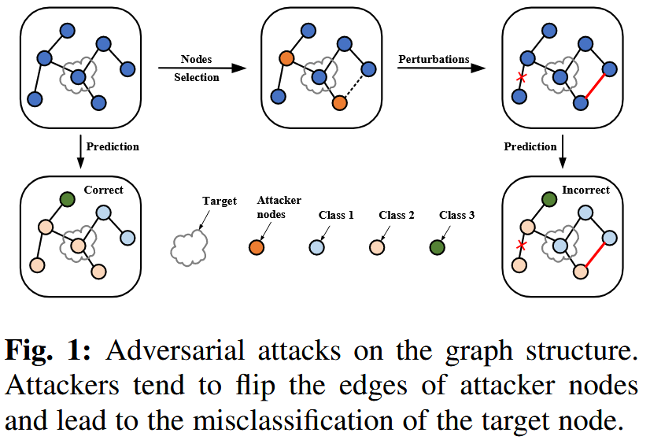
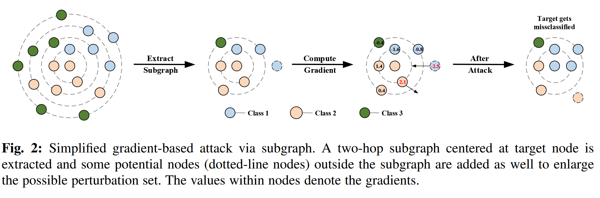
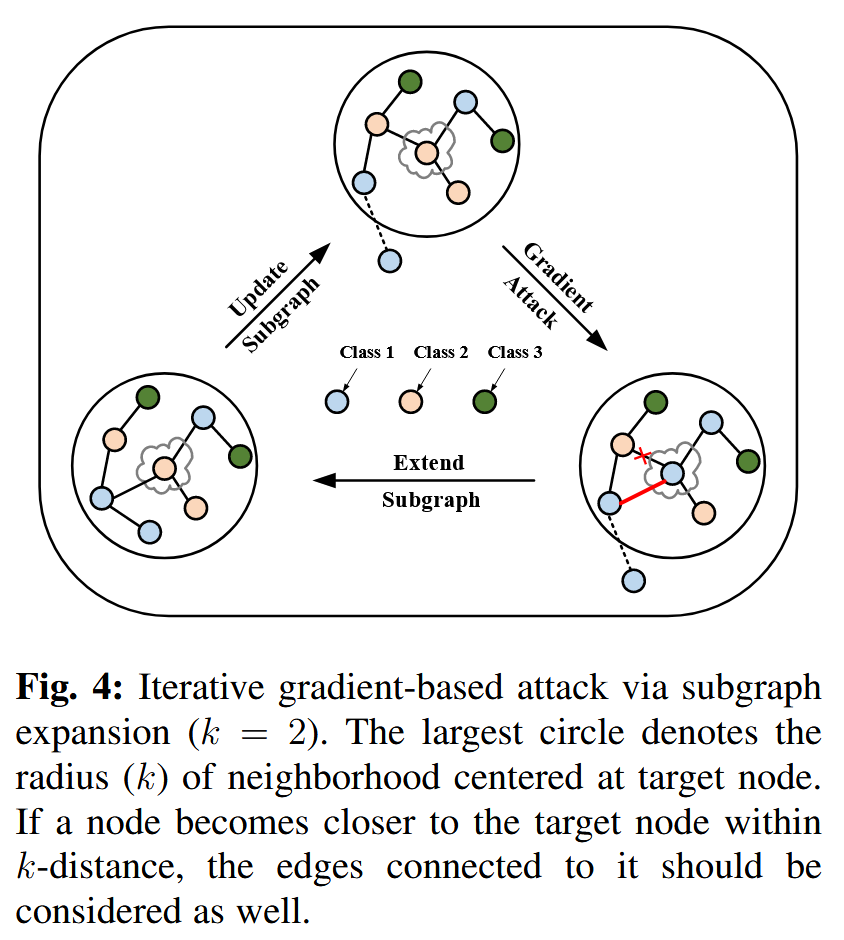
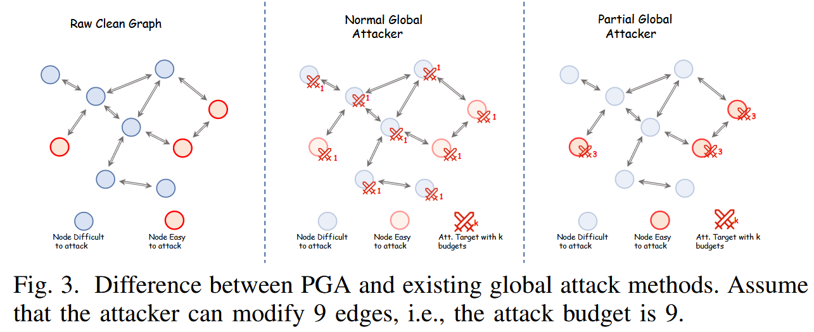
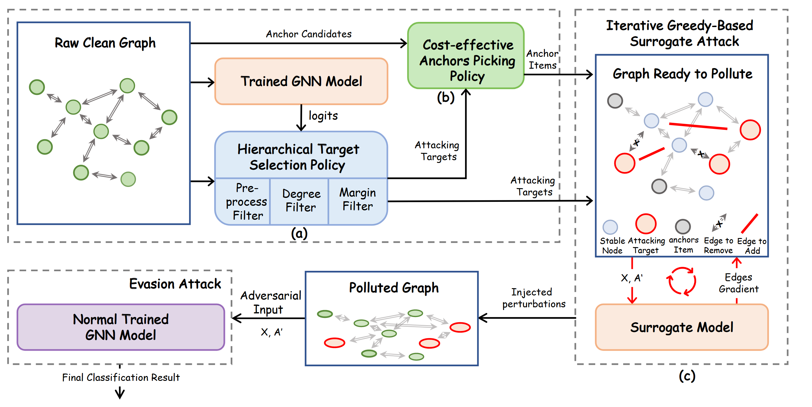
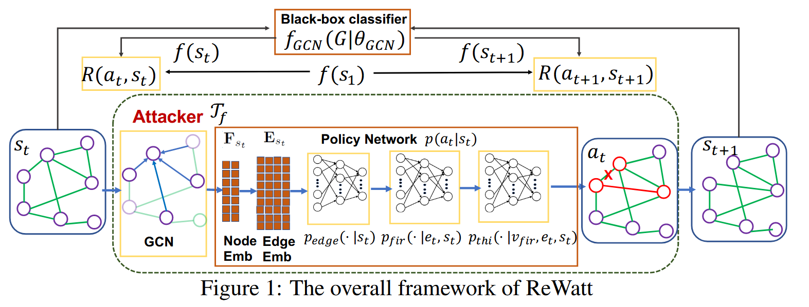
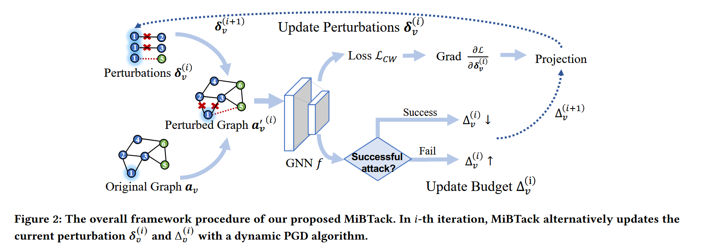

为了解决之前的非侵入式后门和对抗攻击的区别问题，稍微调研了一些对抗攻击的文章，很多方法都是封装的理解了一下，具体细节没有详细给出，日后再更。

## 1、Adversarial Attack on Large Scale Graph(TKDE)

图1展示了针对正常节点分类任务的图对抗攻击流程。图二展现的是扰动添加的的节点集选择方法。图4展示的是整个攻击的具体流程。

具体来说，首先对于一个需要误导分类的节点取它的k近邻子图作为扰动节点集并且计算梯度更新节点集，然后通过节点集内节点的扰动来实现对目标节点的分类干扰。方法主要的意义在于大大减少了时间和空间复杂度。

## 2、Simple and Efficient Partial Graph Adversarial Attack: A New Perspective(TKDE)

文章的核心观点就是进行节点级对抗攻击的时候，把所有的节点都纳入攻击范围时间和空间复杂度实在太高了。我们实际上只需要选择那么容易被攻击的节点进行攻击就可以了。详细流程如下，其实就是通过合适的方法选择节点进行攻击，然后和Surrogate Model进行交互得到最终受污染的图。

## 3、Attacking Graph Convolutional Networks via Rewiring(CoRR)

论文首先提出了即使预算很小，添加或删除边仍然可能对图结构产生“显著”变化，比方说显著影响图的拉普拉斯矩阵的特征值和奇异向量的观点，然后提出了一种新的基于图重连的操作。

具体来说，单个图重连的操作设计三个节点，($v_{fir},v_{sec},v_{thi}$)，在其中我们移除$v_{fir}$和$v_{sec}$之间现有的边，并且在$v_{fir}$和$v_{thi}$之间添加一条新的边。同时该研究将$v_{thi}$设置为$v_{fir}$的2-hop邻居。

然后在实验和理论上论证了这种图重连的影响对拉普拉斯的图属性远小于简单的添加或删除边。

然后文章将一系列的重连操作的过程视为一个离散的马尔可夫决策过程，并使用强化学习来学习如何进行决策。

攻击者接收一个图作为输入，可以修改图的结构以此来欺骗分类器。

## 4、Black-Box Adversarial Attacks on Graph Neural Networks with Limited Node Access(NIPS)

设置在有限节点访问以及节点分类任务的setting下，但是有限节点是可以进行选择的。

当基于梯度的白盒攻击通过梯度和类似pagerank的重要性分数之间的联系推广到黑盒攻击中时，发现损失和错误分类率之间存在差异。当受攻击结点数量增加时，误分类率呈现递减的效应。为此提出了一个贪心程序来纠正考虑收益递减的重要性分数。

## 5、Adversarial Attack on Graph Neural Networks As an Influence Maximization Problem(WSDM)

setting是现实情况和受限的环境下，无法访问模型参数和模型预测，只能扰动一小部分节点特征。

将图上节点扰动的问题与影响最大化问题联系起来，最终将看对抗性攻击表述为优化问题，以最大限度的提高所选节点级的错误分类率。

## 6、Minimum Topology Attacks for Graph Neural Networks(WWW)

## A Practical Adversarial Attack on Graph Neural Networks by Attacking Single Node Structure(HPCC/DSS/SmartCity/DependSys)

## Imperceptible Graph Injection Attack on Graph Neural Networks(COMPLEX & INTELLIGENT SYSTEMS)

## Adversarial Attack Framework on Graph Embedding Models with Limited Knowledge(TKDE)

节点分类以及不访问模型预测以及数据标签的setting。