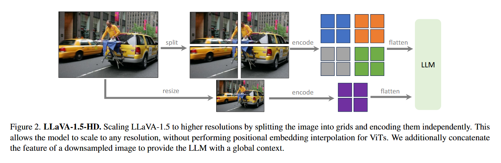

## 1、《Improved Baselines with Visual Instruction Tuning》

本文提出了第一个系统研究来调查LLaVA框架下受控环境中LMM的设计选择，证明了LLaVA中fully-connected vision-language connector非常强大以及数据高效。感觉像是把各种trick统一在一起研究了一下然后给定了一个benchmark，最后有一个自己的sota结果。不过在广泛尝试的过程中也有一些有意思的发现：
- LLaVA架构在通过简单将图片划分为网格并保持data efficiency来拓展到更高的分辨率的策略是多样的，随着分辨率提高，它提高了模型的细节感知能力并减少了幻觉。
- 多模态大模型具有组合能力，例如对于长形式语言推理和较短的视觉推理进行训练可以提高模型对多模态问题的编写能力(可能就是在能力方面遗忘性问题不是很严重？)
- Data efficiency：将LLaVA的训练数据混合随机下采样高达$75\%$ 并不会显著降低模型性能，这表明有可能更复杂的数据集压缩策略可能可以进一步改善LLaVA已经很高效的训练流程。
- Data scaling：证明了数据粒度的扩展与模型的能力

## 2、《Learning Transferable Visual Models From Natural Language Supervision》

