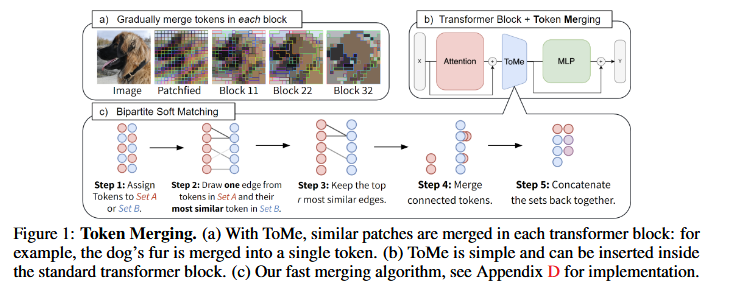
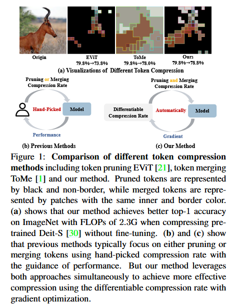
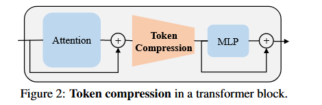
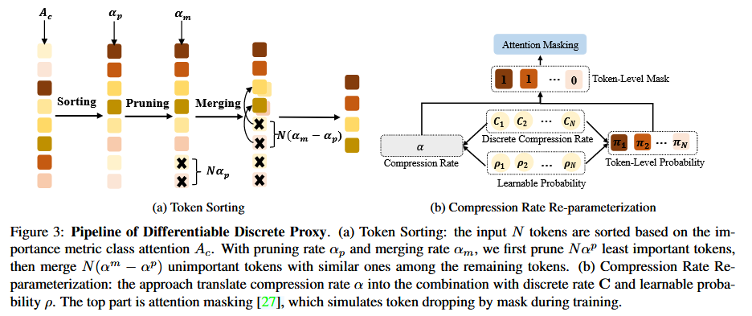

## 《Improved Baselines with Visual Instruction Tuning》

本文提出了第一个系统研究来调查LLaVA框架下受控环境中LMM的设计选择，证明了LLaVA中fully-connected vision-language connector非常强大以及数据高效。感觉像是把各种trick统一在一起研究了一下然后给定了一个benchmark，最后有一个自己的sota结果。不过在广泛尝试的过程中也有一些有意思的发现：
- LLaVA架构在通过简单将图片划分为网格并保持data efficiency来拓展到更高的分辨率的策略是多样的，随着分辨率提高，它提高了模型的细节感知能力并减少了幻觉。
- 多模态大模型具有组合能力，例如对于长形式语言推理和较短的视觉推理进行训练可以提高模型对多模态问题的编写能力(可能就是在能力方面遗忘性问题不是很严重？)
- Data efficiency：将LLaVA的训练数据混合随机下采样高达$75\%$ 并不会显著降低模型性能，这表明有可能更复杂的数据集压缩策略可能可以进一步改善LLaVA已经很高效的训练流程。
- Data scaling：证明了数据粒度的扩展与模型的能力

## 《TOKEN MERGING: YOUR VIT BUT FASTER》
提出Token Merging(ToMe)，将tokens合并(merge)而不是修剪(prune)，方法示意图如下：

总体来说还是很直观的，算是simple but effective的工作。在transformer每个块中attention层和mlp层之间加上一个token merge的操作，根据token相似度以及预先定义好的合并token数量$r$来进行token的合并。

## 《DiffRate : Differentiable Compression Rate for Efficient Vision Transformers》

可以看作上面那篇的续作，提出DiffRate，将在**损失函数梯度传播到压缩比中，使得过去人为指定的压缩比超参数变得可以学习**，同时，token的prune和merge可以自然地同时执行，与其他方法对比图如下：

### Intro：
为了追求更有效的ViTs，有权重剪枝(weight prune)、量化(quantization)和蒸馏(distillation)、token压缩(token compression)等方法。其中token压缩可以在**不对网络结构修改的前提下使用**并且**与其他压缩方法正交**。

token压缩主要分为两类：
- token prune：识别重要性较低的不相关背景标记。
- token merge：不仅丢弃一些背景标记，还合并信息量较少的前景标记。

但是因为模型的各种复杂性指标和不同层的压缩率是相关的，所以设置分层的压缩率来满足复杂性约束同时尽可能保留ViT的性能是很麻烦的。并且信息丰富的前景token很容易因为精心挑选的压缩率而被丢弃。

为了解决上述问题提出了DiffRate，方法如下图所示，还是比较直观的：

## 《Learning Transferable Visual Models From Natural Language Supervision》

