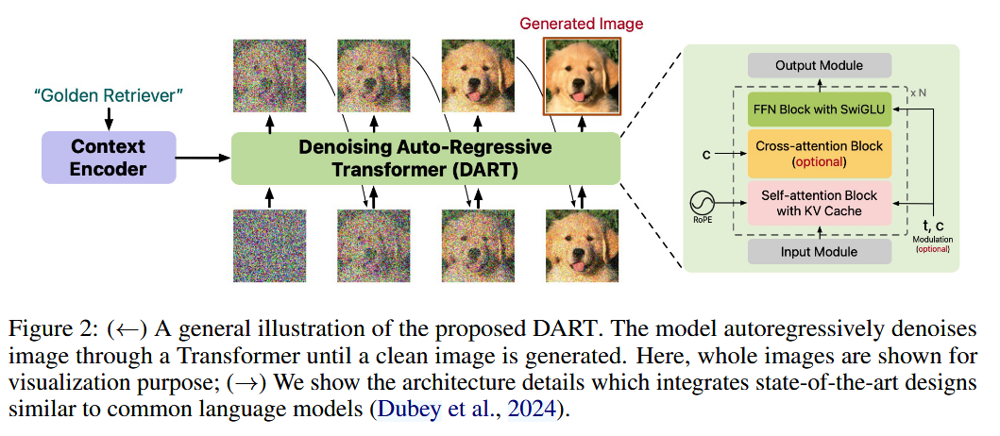
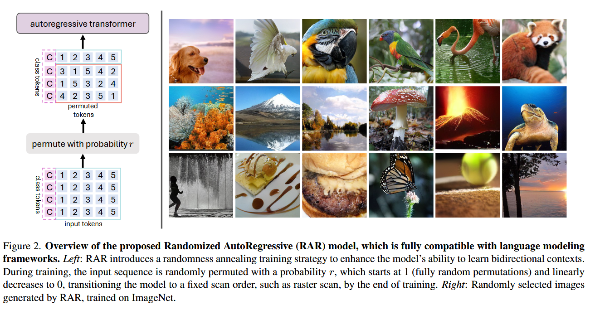
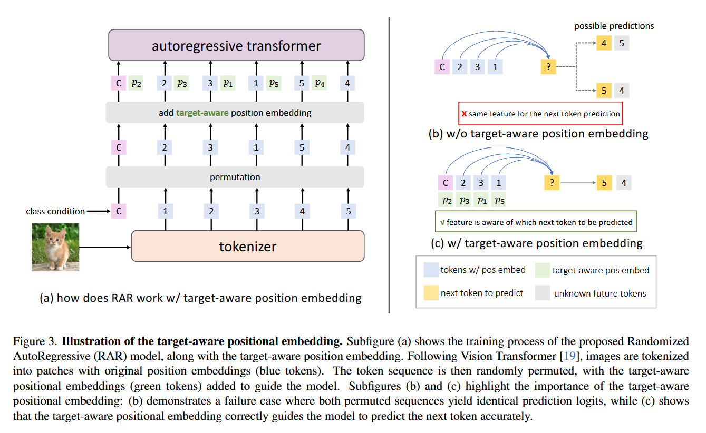
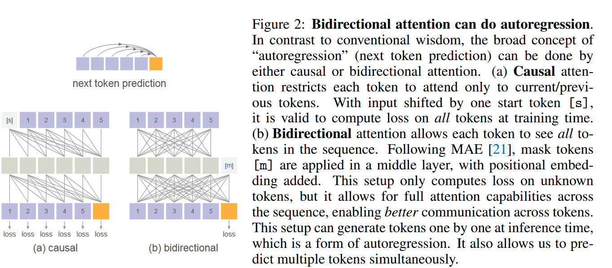
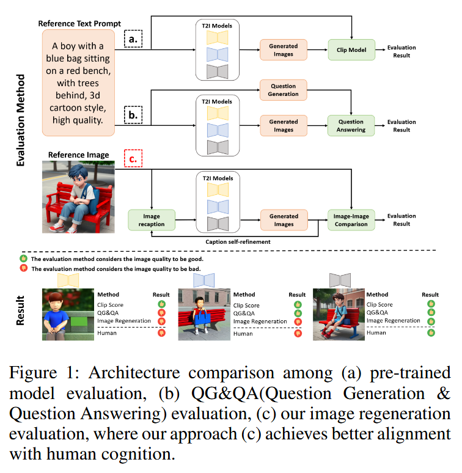
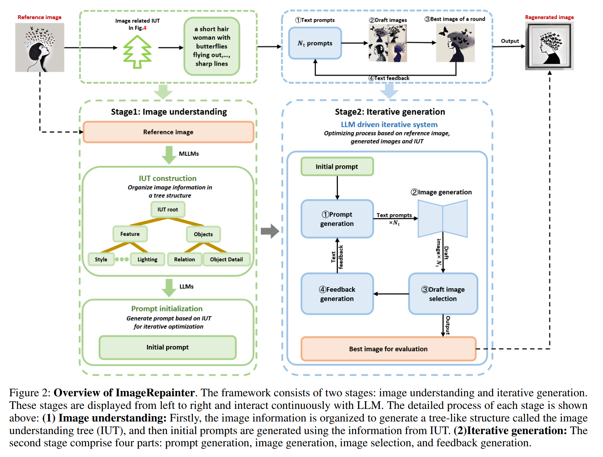
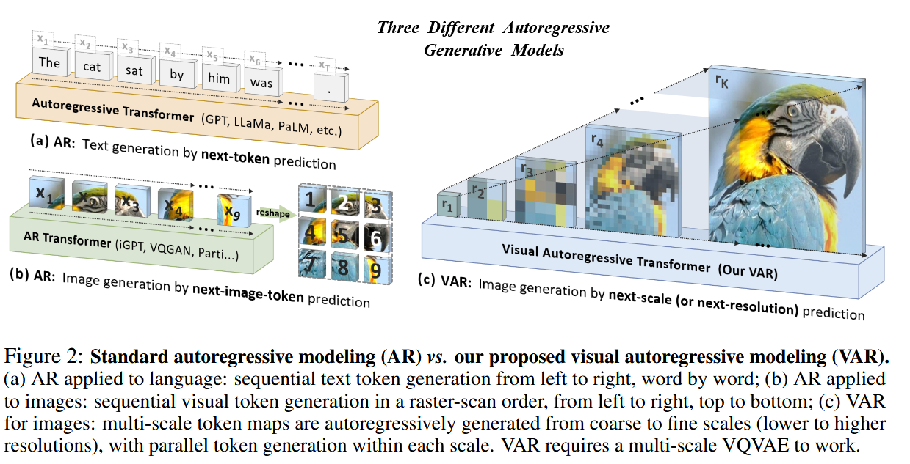
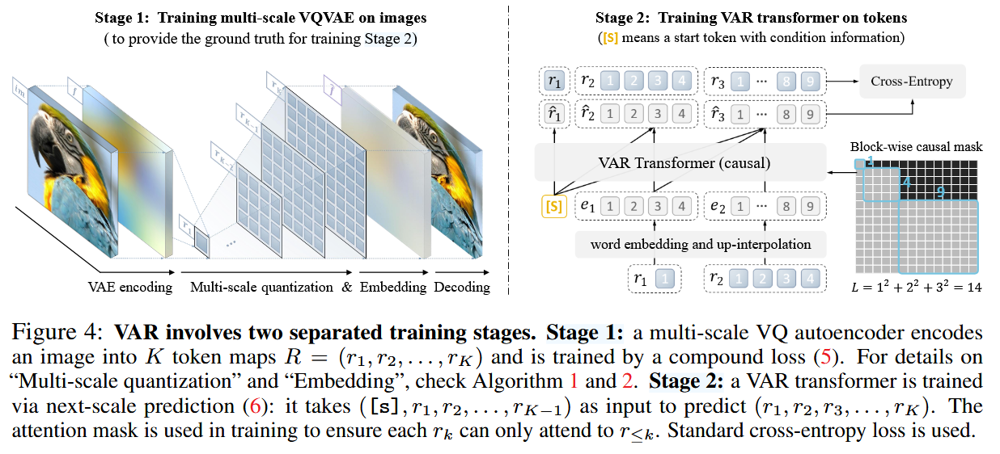
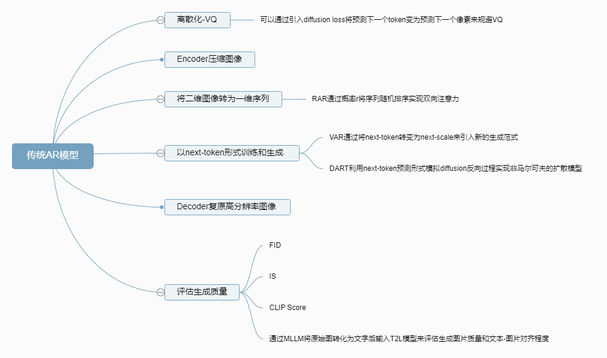

## 《DART: DENOISING AUTOREGRESSIVE TRANSFORMER  FOR SCALABLE TEXT-TO-IMAGE GENERATION》

### Intro
首先介绍了**Diffusion Model**的原理以及他的缺陷
- 原理：逐步向图像添加高斯噪声并学习一系列的去噪步骤来逆向该过程。

- 缺陷：这些模型很难直接在高分辨率图像上进行训练

- 目前已有的解决方案：级联模型、multiscale方法、或者将图像预处理为较低的分辨率。

- 缺陷的可能原因：对马尔可夫假设的依赖，该假设限制了模型只能看到上一步的生成过程，导致训练和推理过程效率低下。

Diffusion models具有固定的后验分布，并通过去噪目标进行训练。他通过迭代过程以非自回归方式生成整个图像。具体来说，给定一个图像 $x_0 \in \mathbb{R}^{3 \times H \times W}$，我们定义一系列的潜变量 $x_t$ ($t = 1, \cdots, T$)，它们遵循马尔可夫过程，逐渐向原始图像 $x_0$ 添加噪声。转移概率 $q(x_t | x_{t-1})$ 和边缘概率 $q(x_t | x_0)$ 分别定义如下：

$$q(x_t | x_{t-1}) = \mathcal{N}(x_t; \sqrt{1 - \beta_t} x_{t-1}, \beta_t I), \quad q(x_t | x_0) = \mathcal{N}(x_t; \sqrt{\bar{\alpha}_t} x_0, (1 - \bar{\alpha}_t) I)$$

其中 $\bar{\alpha}_t = \prod_{\tau=1}^t (1 - \beta_\tau)$，$0 < \beta_t < 1$ 由噪声调度确定。该模型学习反向这一过程，使用后向模型 $p_\theta(x_{t-1} | x_t)$，旨在去除图像中的噪声。模型的训练目标是：

$$ \min \mathcal{L}_{\theta}^\text{DM} = \mathbb{E}_{t \sim [1,T], x_t \sim q(x_t | x_0)} [\omega_t \cdot \| x_\theta(x_t, t) - x_0 \|_2^2]$$

其中 $ x_\theta(x_t, t) $ 是时间条件化的去噪器，它学习将嘈杂样本 $x_t$ 映射到其干净版本 $x_0$; $\omega_t$ 是时间依赖的损失加权项，通常使用SNR或SNR+1。实际上，$x_t$ 可以用噪声或 v 预测重新参数化来提高性能，并可以应用于像素空间或潜在空间，由 VAE 编码器编码。然而，标准扩散模型计算效率低下，需要大量的去噪步骤和广泛的训练数据。此外，它们缺乏有效利用上下文的能力，阻碍了对复杂场景和长序列如视频的扩展性。

然后介绍了类似GPT-4的**自回归模型**，目前的自回归模型研究有将基于扩散的思想进行引入，但是仍然没有充分利用Diffusion Model的渐进式去噪优势，导致生成过程中局限的全局上下文和错误传递。

图像上的自回归模型与基于扩散的方法不同，这些方法通常专注于学习离散图像tokens之间的依赖关系。为了详细说明，考虑一张图像 $\boldsymbol{x} \in \mathbb{R}^{3 \times H \times W}$。首先将这张图像编码成一串离散tokens $z_{1:N} = \mathcal{E}(\boldsymbol{x})$。这些tokens被设计用于近似地重建原始图像，通过一个学习解码器 $\hat{\boldsymbol{x}} = \mathcal{D}(z_{1:N})$。然后，自回归模型通过最大化交叉熵来训练，如下所示：

$$\max \mathcal{L}_{\theta}^{\mathrm{CE}} = \sum_{n=1}^{N} \log P_{\theta}\left(z_n|z_{0:n-1}\right)$$

其中 $z_0$ 是特殊的开始token。在推理阶段，自回归模型首先从学到的分布中采样token，然后使用 $\mathcal{D}$ 将它们解码回图像空间。

自回归模型提供了比扩散模型更显著的效率优势，通过缓存先前步骤并在单个并行前向传递中完成整个生成过程。这减少了计算开销并加速了训练和推理。然而，对量化技术的依赖可能会导致信息丢失，从而降低生成质量。此外，token预测的线性和逐步性质可能忽视全局结构，使得捕捉复杂场景或序列中的长程依赖和整体连贯性变得困难。

**非马尔科夫扩散模型(NOMAD)** 学习以下带权重的ELBO损失，带有可调的 $\tilde{\omega}_t$：

$$
\max \mathcal{L}_{\theta}^{\text{NOMAD}} = \mathbb{E}_{\boldsymbol{x}_{1:T} \sim q(\boldsymbol{x}_0)} \left[ \sum_{t=1}^T \tilde{\omega}_t \cdot \log p_{\theta}(\boldsymbol{x}_{t-1}|\boldsymbol{x}_{t:T}) \right]
$$

其中 $q$ 是预定义的推断过程。这种表述与自回归模型在公式上有许多相似之处，每个token代表一个嘈杂的样本 $\boldsymbol{x}_t$。因此，很自然地用transformer实现这样的过程。

然而，标准扩散模型的马尔科夫推断过程使生成器 $\theta$ 无法使用除了 $\boldsymbol{x}_t$之外的所有上下文。也就是说，即使将生成器初始化为 $p_{\theta}(\boldsymbol{x}_{t-1}|\boldsymbol{x}_{t:T})$，模型只需要 $\boldsymbol{x}_t$ 中的信息就能最好地去除 $\boldsymbol{x}_{t-1}$ 的噪声。因此，设计一个固定且非马尔科夫的推断过程 $q(\boldsymbol{x}_t|\boldsymbol{x}_{0:t-1})$ 来采样嘈杂序列 $\boldsymbol{x}_{1:T} \sim \boldsymbol{x}_0$ 至关重要。最简单的方法是对独立的噪声过程执行操作：

$$
q(\boldsymbol{x}_t|\boldsymbol{x}_{0:t-1}) = q(\boldsymbol{x}_t|\boldsymbol{x}_0) = \mathcal{N}(\boldsymbol{x}_t; \sqrt{\gamma_t} \boldsymbol{x}_0, (1-\gamma_t)\mathbf{I}), \quad \forall t \in [1, T]
$$

其中 $\gamma_t$ 表示非马尔科夫噪声调度。在实践中，也可以选择一个更复杂的非马尔科夫过程，如DDIM中所述。此外，可以证明以下命题：

**命题1**：一个具有独立噪声 $\gamma_t$ 的非马尔科夫扩散过程 $\{\boldsymbol{x}_t\}_t$ 与其具有相同步数和噪声水平 $\{\overline{\alpha}_t\}_t;\{\boldsymbol{y}_t\}_t$ 的马尔科夫扩散过程之间存在双射，当其噪声水平满足 $\frac{\overline{\alpha}_t}{1-\overline{\alpha}_t} = \sum_{\tau=t}^T \frac{\gamma_{\tau}}{1-\gamma_{\tau}}$ 时，达到最大信噪比。

### Denoising AutoRegressive Transformer (DART)

为了解决上述Diffusion Model和自回归模型各自的缺陷，作者提出了DART：一种将自回归模型与非马尔可夫Diffusion框架结合的模型，具体如下图所示。

DART，一种基于Transformer的生成模型，它实现了非马尔可夫扩散过程，并且具有独立的噪声化过程。首先，遵循DiT，我们将每个图像表示为其潜在映射，通过预训练的VAE进行patchify和flatten处理。然后，DART将生成建模为：

$$ p_{\theta}(x_{t-1} | x_{t:T}) = \mathcal{N}\left(x_{t-1}; \sqrt{\gamma_{t-1}} x_{\theta}(x_{t:T}), (1 - \gamma_{t-1})I\right)$$

其中 $x_{\theta}(\cdot)$ 是一个Transformer网络，它接受拼接后的序列 $x_{t:T} \in \mathbb{R}^{K(T-t)\times C}$，并预测下一个有噪图像的“均值”。可以简化之前的NOMAD方程如下：

$$
\min \mathcal{L}_{\theta}^{\text{DART}} = \mathbb{E}_{x_{1:T} \sim q(x_0)} \left[ \sum_{t=1}^T \omega_t \cdot \| x_{\theta}(x_{t:T}) - x_0 \|_2^2 \right],
$$

其中定义 $\omega_t = \frac{\gamma_{t-1}}{1-\gamma_{t-1}} \tilde{\omega}_t$ 来简化记号。类似于标准AR模型，在$ T $个去噪步骤中是并行计算的，不同步骤之间的计算共享。使用块基因果掩码来保持自回归结构（见图3(a))。

从简化的NOMAD方程可以看出，目标函数与原始的Diffusion方程相似，表明DART可以像标准扩散模型一样稳健地训练。此外，通过在自回归框架内利用扩散轨迹，DART允许纳入大型语言模型的设计原则。此外，命题1指出，可以根据其关联的扩散过程选择 $\omega_t$ 。例如，对于SNR加权，$\omega_t$ 可以定义为 $\omega_t = \sum_{\tau=t}^T \frac{\gamma_\tau}{1-\gamma_\tau}$。

从DART采样非常简单：只需预测均值 $x_{\theta}(x_{t:T})$，添加高斯噪声得到下一步 $\hat{x}_{t-1}$，并将该结果传递到下一次迭代。不需要复杂的求解器，无分类器引导应用于 $x_{\theta}$ 的预测。此外，KV-cache用于增强解码效率。

简单来说就是用transformer预测token流的形式来模拟扩散模型反向去噪的过程。

## 《Randomized Autoregressive Visual Generation》

文本数据是高度紧凑有序、含有语义意义，但是视觉数据往往更加low-level和冗余。过去关于自回归视觉模型的研究集中于将图像表示为**像素序列**，在受到最近的自回归语言模型的影响后将注意力转移到将图像建模为**离散值的tokens**,所以目标在于提高tokenization的质量以及使用现在的语言模型自回归模型架构进行训练。

然而这些工作都严格遵守处理像素或者tokens的raster-scan顺序，结果就是其实**单向的信息流对于视觉模型而言并不是最佳的**。这些传统的自回归模型依赖于因果注意力掩码，这强制了对token序列的单向依赖，但是在视觉模型中**双向注意力的效果是要明显优于因果注意力的**。

在本文中提出了一种新的视觉生成方法**RAR**(Randomized AutoRegressive)。具体来说，输入序列以概率$r$随机排列成不同的顺序，$r$从1开始在训练过程中线性衰减到0，r的衰减具体如下。

$$
r = 
\begin{cases}
    1.0, & \text{if } epoch < start, \\
    0.0, & \text{if } epoch > end, \\
    1.0 - \frac{epoch - start}{end - start}, & \text{otherwise},
\end{cases}
$$

其中，$epoch$ 是当前的训练轮数。

模型的优化目标如下：

$$
 \max_{\theta} p_{\theta}(\mathbf{x}) = \mathbb{E}_{\tau \sim S_T} \left[ \prod_{t=1}^T p_{\theta}(x_{\tau_t} | x_{\tau_{<t}}) \right]$$

其中 $ S_T $ 表示索引序列 $[1, 2, \cdots, T]$ 的所有可能排列的集合，$\tau$ 表示从 $S_T$ 中随机采样的排列。记号 $\tau_t$ 指代排列后的序列中的第 $t$-th 元素，而 $\tau_{<t}$ 表示到 $\tau_t$ 所有前面的位置。由于模型参数 $\theta$ 在所有采样因子化顺序中共享，因此每个token $x_t$ 都暴露于所有可能的上下文中，并且在训练期间与其他任何token $x_i$ 学习relationship，其中 $i \neq t$。这允许模型有效地捕获双向上下文同时保持自回归公式化的完整性。

具体的架构和形象化表示可以见下两张图：

## 《Autoregressive Image Generation without Vector Quantization》

正如文章标题一样，作者认为使用**VQ自编码器将连续图像变为离散图像其实并不是必须的**，在本文中作者尝试抛弃VQ转而使用**扩散模型**。

首先简单介绍一下过去的方法：使用自回归模型生成图像时首先把连续的像素值划分为离散的token，然后按照人工定义的顺序进行标号，最后输入于文本自回归模型一样的模型架构中基于next-token的形式进行训练和生成。同时因为图像像素数量非常庞大，所以逐个像素生成速度缓慢，为了加速我们借用Encoder-Decoder架构首先将连续图像变成离散图像并减少要生成的像素数量，然后也可以根据自回归模型生成的压缩图像复原成为原来的真实图像。

过去图像自回归任务中训练时由于像素转换为离散的token形式所以可以使用交叉熵损失训练来预测下一个像素的类别分布，而作者为了避免将像素值离散化直接根据已有的像素生成下一个像素。

具体来说，他引入了扩散损失：
$$
\mathcal{L}(z, x) = \mathbb{E}_{\varepsilon, t} \left[ \| \varepsilon - \varepsilon_\theta(x_t | t, z) \|^2 \right]
$$

这里，$\varepsilon \in \mathbb{R}^d$ 是从 $\mathcal{N}(\mathbf{0}, \mathbf{I})$ 抽取的噪声向量。噪声污染的向量 $x_t$ 定义为 $x_t = \sqrt{\bar{\alpha}_t} x + \sqrt{1-\bar{\alpha}_t} \varepsilon$，其中 $\bar{\alpha}_t$ 定义了噪声调度。$t$ 是噪声调度的时间步。噪声估计器 $\varepsilon_\theta$，由 $\theta$ 参数化，是一个小型 MLP 网络。记号 $\varepsilon_\theta(x_t | t, z)$ 表示此网络将 $x_t$ 作为输入，并且以$t$和$z$均为条件。

在经过一定实验后，作者发现使用更加先进的自回归模型代替标准自回归模型时模型生成能力的提升要大得多，具体来说又有一下探索：
- 双向注意力：token两两之间互相传递信息，比causal效果更好但是无法进行句子的并行训练也没有了KV cache加速推理手段。
- 掩码自回归模型：模型生成的顺序不一定是从左到右、从上往下，我们可以自定义一个顺序给token编号后一次生成多个token。

## 《Image Regeneration: Evaluating Text-to-Image Model via Generating Identical Image with Multimodal Large Language Models》

文生图模型的算法和应用在快速进步，但是评估质量方面仍然并不令人满意，现有的文生图模型侧重于两种模态：**输入的文本**和**输出的图片**。

该文作者认为这样进行评估本质上涉及两种模态之间的差异以及信息的不对称,下图为本文评估方法与过去其他方法的不同。

评估方法的具体架构如下,应该还是比较好懂的：

我个人的理解就是利用MLLM对图像的理解能力和文本生成能力生成标准的细粒度文本描述来用于T2I模型的图像生成任务，这既在一定程度上弥补了两种模态之间信息的不对称同时也充分保证了信息的对等。

## 《Visual Autoregressive Modeling: Scalable Image Generation via Next-Scale Prediction》

作者提出了视觉自回归模型(VAR)，与raster-scan扫描“下一个分辨率”不同，它将图像的自回归学习重新定义为从粗到细的“下一个尺度预测”或“下一个分辨率预测”。

下图很好地展示了文本自回归模型、基于next-image-token的视觉自回归模型以及本文基于next-scale的视觉自回归模型之间的区别。

过去基于next-token形式的自回归模型表示如下：
$$
p(x_1, x_2, \ldots, x_T) = \prod_{t=1}^{T} p(x_t \mid x_1, x_2, \ldots, x_{t-1})
$$

而作者将图像上的自回归建模从next-token转变next-scale。在这里，自回归单元是一个完整的映射，而不是单个token。他们开始量化特征映射 $f \in \mathbb{R}^{h \times w \times C}$ 成为 $K$ 阶段token映射$(r_1, r_2, \dots, r_K)$，每个映射具有越来越高的分辨率 $h_k \times w_k$，最终得到原始特征映射的分辨率 $h \times w$。自回归似然被表述为：

$$ p(r_1, r_2, \dots, r_K) = \prod_{k=1}^{K} p(r_k \mid r_1, r_2, \dots, r_{k-1}) $$
其中每个自回归单元 $r_k \in [V]^{h_k \times w_k}$ 是尺度 $k$ 上的token映射，包含 $h_k \times w_k$ tokens，以及序列 $(r_1, r_2, \dots, r_{k-1})$ 作为 $r_k$ 的“前缀”。在第 $k$ 个自回归步骤中，所有分布在 $r_k$ 中的 $h_k \times w_k$ tokens 将被并行生成，条件是在 $r_k$ 的前缀及其关联的第 $k$ 位置嵌入映射上。这种“下一个尺度预测”的方法是我们定义的视觉自回归嵌入建模（VAR）的方法，如下图右侧所示。请注意，在VAR的训练过程中，使用块状因果注意力掩码确保每个 $r_k$ 只能关注其前缀 $r_{\leq k}$。在推理阶段，kv缓存可以使用，不需要掩码。

对上述文章简单做了一个汇总和整理的导图如下：

Reference:

本文撰写过程中除了原文及其开源代码之外还参考了[EDPL](https://zhuanlan.zhihu.com/p/692425580)和[周奕帆](https://zhuanlan.zhihu.com/p/710748815)的博客，感谢大佬的开源分享。