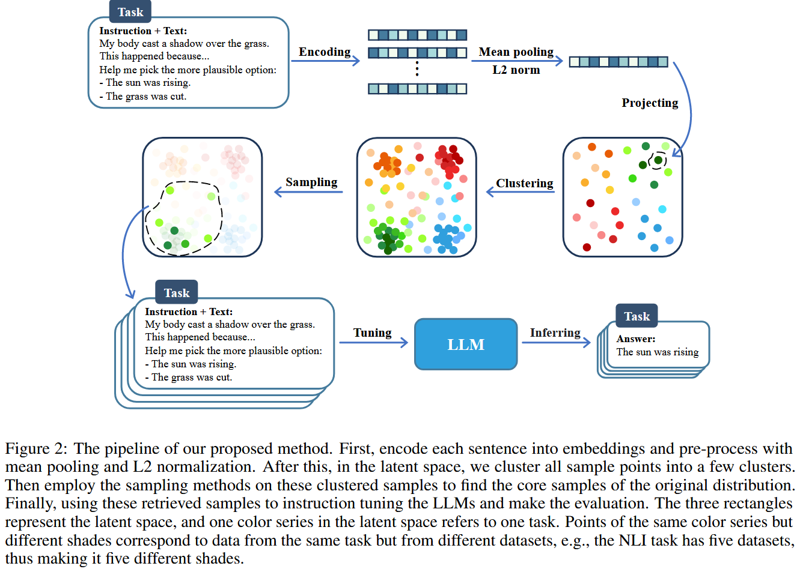
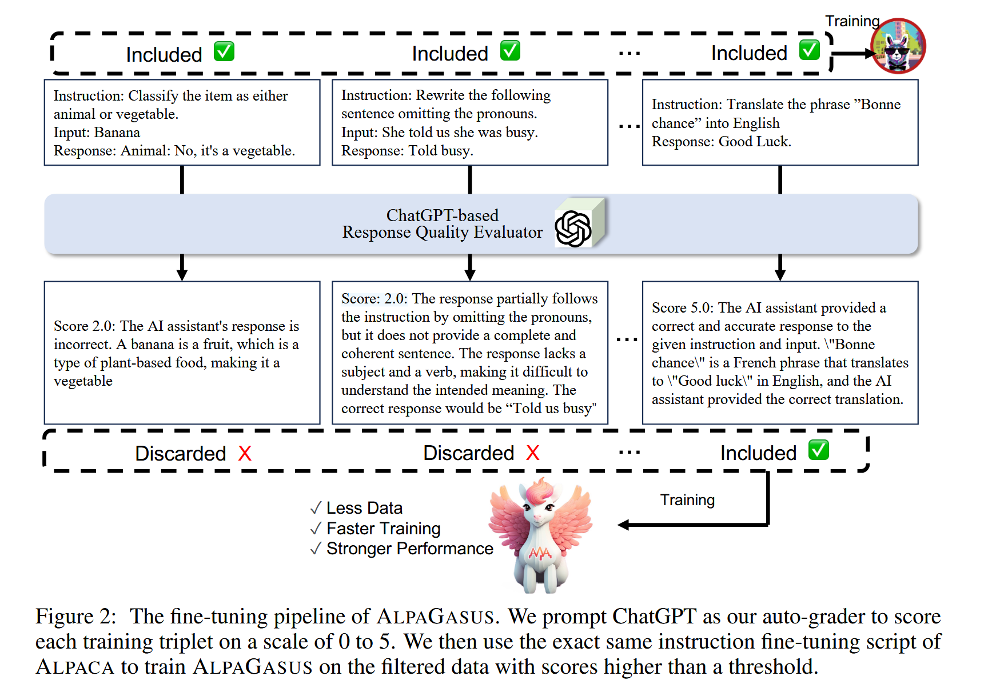
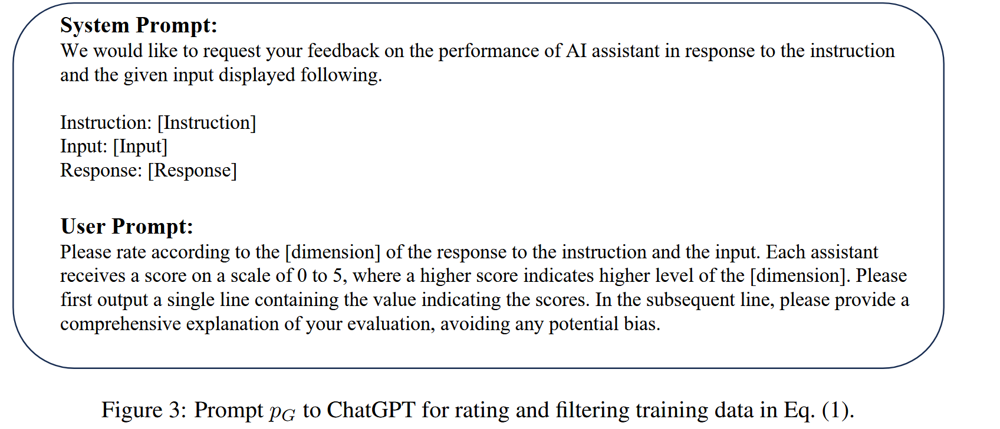
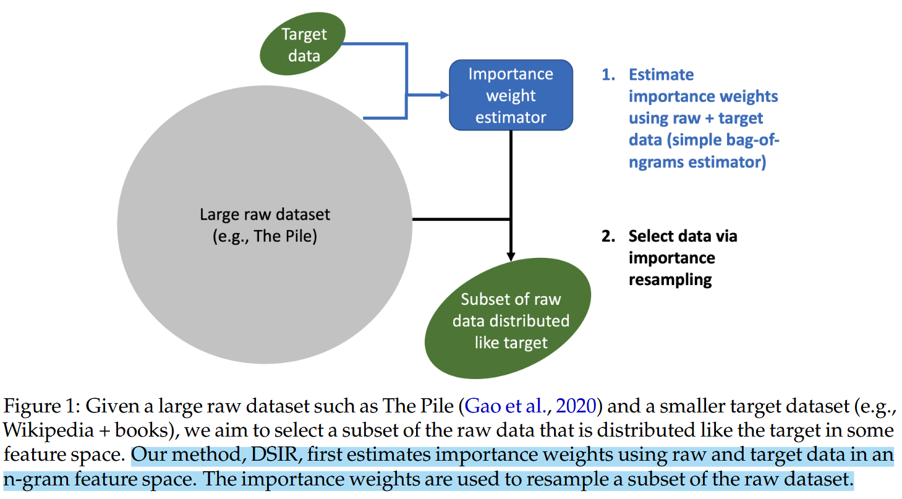
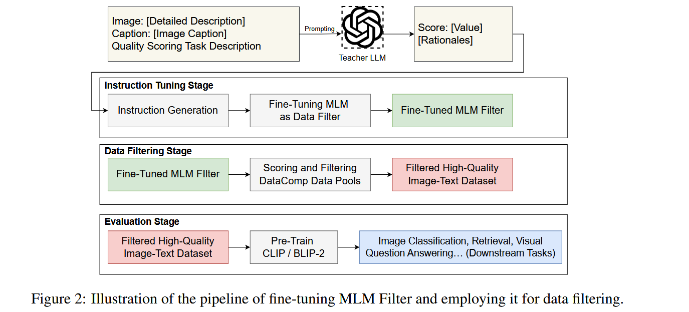
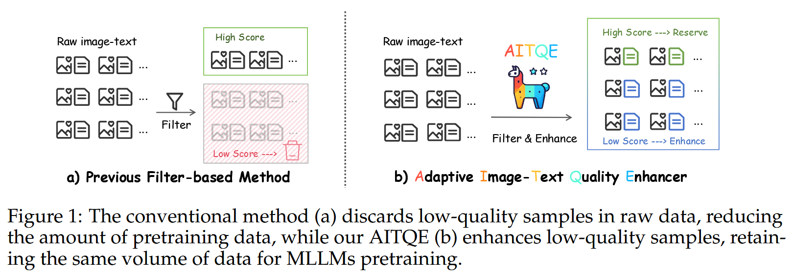
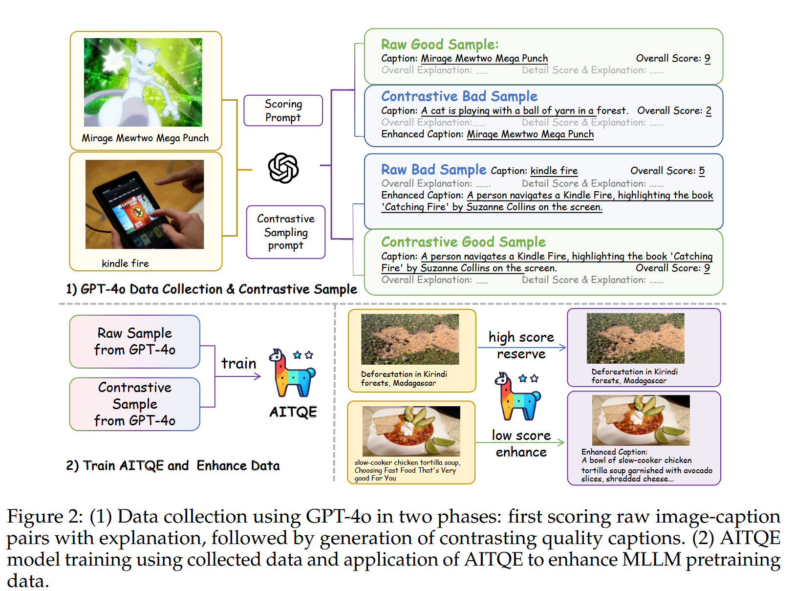

## Supervised Fine-Tuning

### 《MAYBE ONLY 0.5% DATA IS NEEDED: A PRELIMINARY  EXPLORATION OF LOW TRAINING DATA INSTRUCTION TUNING》

该文作者觉得现在缺乏与指令调整相关的研究来减少训练阶段使用的数据量来降低训练成本。

他们通过减少任务和指令的多样性来大量减少微调数据集的规模并仍然保证他在特定任务上的效果。

具体来说，他们的目标是从现有数据中识别中最有价值的核心样本，帮助模型获取下游任务所需要的知识，并仅用少量数据就能实现同等甚至更好的性能。

在实现方法上如上图所示，对文本数据使用预训练模型进行encoding然后进行均值池化和L2正则化，之后在一维向量 空间中使用K-means聚类来获得同一类别下游任务对应的数据并选择每个人物对应的中心点，最后使用KCentergreedy采样来获得一个缩小的但是接近完整数据集分布的小集合。

### 《ALPAGASUS: TRAINING A BETTER ALPACA WITH FEWER DATA》(ICLR 2024, LLM)

该文根据上图的prompt和流程调用GPT-4对alpaca52k数据集进行打分然后选择重要数据组合为9k数据集并在微调中取得了更好的结果。个人认为是一个比较偏向于工程的工作，但是这个工程的架构好像也不是那么的创新？特地去翻了一下当时reviewer的评价发现也是说novelty并不是很够，不过实验效果很好，最后666中的。

## Pretrain

### 《NOISE-ROBUST DE-DUPLICATION AT SCALE》(ICLR 2022，LLM)
在大型、嘈杂的语料库中可靠地识别近似重复的文本对于各种应用都很重要，训练数据的重复会降低模型性能。这项研究构建了一个大型重复数据删除数据集，并开发了用于稳健文本重复数据删除的神经方法，其性能显著优于基于N-gram的方法，并且可有效扩展。

具体来说首先使用双编码器模型将文本映射到一个高维向量空间，通过对比学习优化模型，使得相似的文本在向量空间中距离较近，而不相似的文本距离较远。然后使用重新排序方法，这结合了双编码器和交叉编码器。首先使用双编码器进行初步筛选，生成候选对；然后使用交叉编码器对候选对进行更精确的重新排序

实验结果表明，神经网络方法在大规模数据集上显著优于传统的哈希和N-gram重叠方法并且双编码器方法在单个GPU上处理数百万篇文章的速度非常快，具有很高的可扩展性。

### 《Data Selection for Language Models  via Importance Resampling》(NIPS 2023，LLM)
在计算资源紧张的情况下，预训练数据的选择对于语言模型的性能至关重要。该文将预训练数据的选择定义为：从一个大规模的原始未标注数据集中选择一个子集，使其分布与目标分布尽可能接近的问题。具体来说如下图所示：

实现方法如论文标题所言是重要性重采样(Importance Resampling)。即首先估计每个文档在目标分布中的代表性然后进行子集采样来使得他的分布更加接近目标分布。在具体实现上首先使用哈希n-gram来将特征映射到一个固定的大小的向量空间，在保证信息量的同时也提高计算效率。同时定义了KL Reduction指标来衡量所选的预训练数据与目标分布之间的接近程度。

### 《Finetuned Multimodal Language Models Are High-Quality Image-Text Data Filters》
该文的核心正如标题所言：微调的多模态语言模型是高质量的图像-文本数据过滤器。他们设计了四个不同的指标来全面衡量-图像-文本数据的质量，以及建立了一个pipeline来构建高质量的指令数据来微调MMLLM来作为数据过滤器。
指标如下：
- 图文匹配(ITM)：ITM指标重点评估图像标题是否准确地表达了图像的主要特征和对象并抓住了其主要主题。经过微调的 MLM 数据过滤器可以生成精确的ITM分数。
- 对象细节实现(ODF)：ODF 指标重点评估图像标题是否提供与图像对齐的对象的详细描述。具体来说，ODF 评估标题是否充分描述了图像中对象的属性，例如数量、颜色、大小、位置、形状等。与ITM度量相比，ODF度量更关注对象之间的细粒度对齐。图像中的详细对象属性以及相应标题中描述的对象属性。
- 字幕文本质量(CTQ)：CTQ指标侧重于基于语法正确性、词汇多样性(例如单词的范围和独特性)、流畅性(例如句子的流畅性和自然流畅)来评估图像字幕的文本质量，可读性、长度和结构。
- 语义理解(SU)：SU 指标侧重于确定图像标题是否提供仅从图像本身不容易明显看出的附加语义信息。例如人物职业、所在地、建筑物、人物社会关系等等。采用SU度量进行数据过滤可以选择具有辅助语义的图像文本对，这可以进一步增强预训练VLM的常识推理能力。

实现方法如上图所示，首先通过LLM来构建不同指标得分然后利用这些数据来微调MLLM来成为数据过滤器。微调得到的过滤器会给图像-文本数据进行多指标的打分，最后选择质量高的数据进行MLLM的预训练。

### 《Beyond Filtering: Adaptive Image-Text Quality Enhancement for MLLM Pretraining》
过去通过质量增强得到高质量数据的过程中丢弃了很大一部分的图像-文本对。而许多高质量的图像被丢弃仅仅只是因为他们缺乏好的文本描述。这样的过滤方法有两个重大的缺陷：
- 不必要地损失了大量高质量的图像
- 增加了scaling预训练数据的难度，比方说至少收集3000完原始数据对才有可能有1000万相对优质的数据来用于训练。
这篇工作主要是对没有合适的文本描述的高质量图像也补充了优质的文本，从而同时保证数据的质量和数量具体如下图所示：

具体的方法流程和细节如下图所示：

整个方法主要分为两个阶段，第一个阶段是调用GPT-4o对原数据集的图像-文本对进行打分，并且重写低分图像-文本对的文本内容和为高分图像-文本对生成低质量的文本来用于后续对比学习。第二个阶段是使用收集的数据来训练AITOE模型并使用它来增强MLLM预训练数据。