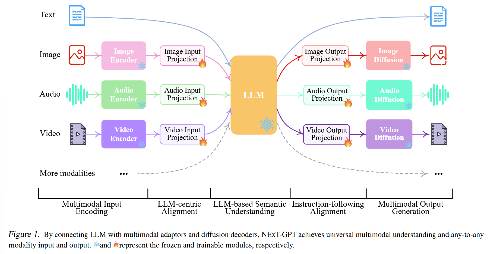
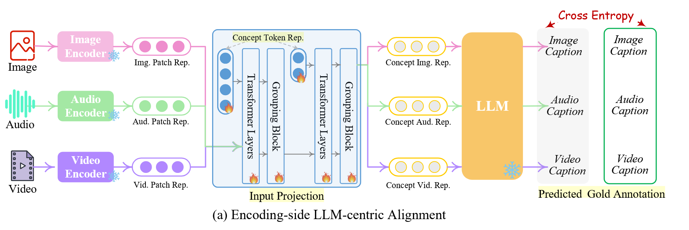
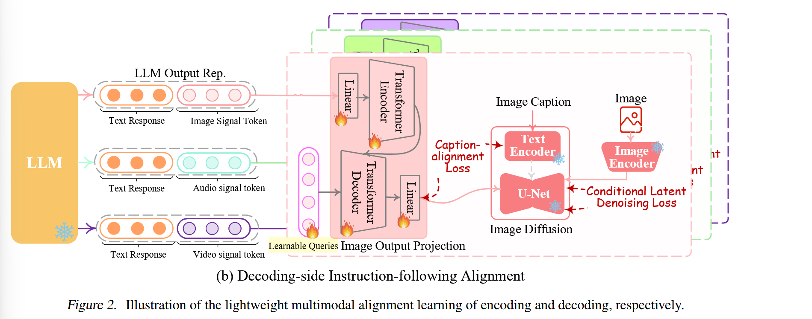
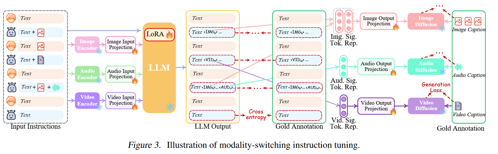

## Title: 
NExT-GPT: Any-to-Any Multimodal LLM

## Paper link:
[Here](https://arxiv.org/abs/2309.05519)

## Code:
[Here](https://github.com/NExT-GPT/NExT-GPT)

因为是读的第一篇近期的多模态论文，所以写得比较详细，很多地方可能会比较啰嗦。

## Motivation:
过去的MM-LLMs大多还是仅限于输入端多模态理解的限制，无法以多种模态生成输出的内容。而人类通过多种模态感知世界并于人们交流，因此开发能够以多种模态接收和输出内容的MM-LLM是重要的。

## Intro
介绍了MM-LLM的必要性并列举了一些已有的方法：
- 使用适配器(adapters)来将其他模态的pre-trained encoders来与文本的llm进行对齐，有BLIP-2、Flamingo、MiniGPT-4、Video-LLaMA、LLaVA、PandaGPT和SpeechGPT。但是他们都只关注了输入端的多模态。
- 也有一些工作尝试了输出端的多模态，例如DREAMLLM、GILL、SEED，但是他们的输出模态仅限于交错的文本和图片。
- 还有的工作努力来模仿人类的多模态转换能力。CoDi在实现同时处理和生成任意模态组合的能力方面取得了很大进步，但缺乏LLM为核心的推理和决策能力，并且也局限于简单的配对内容生成(还没看原文，感觉应该是只统一了模态转换，但是没有理解模态内容的能力？)。而Visual-ChatGPT和HuggingGPT尝试结合外部工具，但是整个pipeline存在一些问题。首先是不同模块的消息传递完全基于LLM产生的离散文本，模块相连的过程会引入噪声，更重要的是，整个系统利用现有的预训练工具只是用在推理，由于缺乏整体的端到端训练，内容理解和多模态生成能力是极其有限的，尤其是在解释复杂和有隐含意义的用户指令方面。

## 架构

根据图1可以看到其实主要就是三个部分，编码、LLM理解和推理和解码。

### Multimodal Encoding Stage
主要就是用了ImageBind(一种跨六种模式的统一高性能编码器)，然后借助投影层，不同的输入表示会被映射为近似于语言表示的形式，来使得LLM能够理解和推理。

### LLM Understanding and Reasoning Stage
该文使用了Vicuna (7B-v0)，将不同模态的表示作为输入，并对输入进行语义理解和推理。它输出: 
- 直接的文本相应
- 每种模态的信号标记，用作指示decoder层是否生成多模态内容以及如果是的话则生成什么内容的指令。

### Multimodal Generation Stage
如果接收到了LLM给出的具有特定指令的多模态信号，基于transformer的输出投影层会将信号token表示映射为多模态decoders能够理解的表现形式。

在投影层之后，信号表示被输入到条件扩散模型中来生成内容。

## 轻量级的多模态对齐学习
为了弥补不同模态特征空间之间的差距，并且确保不同输入的流畅的语义理解，有必要堆NExT-GPT进行对齐学习。然后因为前面的架构，实际上这份工作只需要更新encoding和decoding部分的两个投影层。

### Encoding-side LLM-centric Multimodal Alignment

大多数现有的MM-LLM采用基于transformer架构的多模态编码器，他们通过线形层将多模态特征直接投影到文本特征空间中，从而多模态特征可以转换为LLM可以理解的方式。但是这种patch-based feature units 可能无法与复杂的文本标记语言最一致，因为直观上语言标记总是封装单独的概念，这可能会导致MM-LLM的信息感知不理想。

而本文设计了一种可学习的概念标记(learnable concept tokens)，通过分组机制将grid-level features分层聚合为语义概念标记(semantic concept tokens)，然后将概念表示输入到LLM中。为了完成这个对齐，他们通过现有的语料库和给定的图像、视频、音频的文本描述数据集上进行学习。

### Decoding-side Instruction-following Alignment

在decoder端，他们集成了来自外部资源的预训练条件扩散模型。主要目的是把LLM的输出指令和扩散模型保持一致，但是把每一种扩散模型和LLM之间都进行对齐的计算负担很大。他们提出了解码端指令跟随对齐的方法(decoding-side  instruction-following alignment)。具体来说他们设计了三种类型的特殊标记(special tokens)来作为图像信号、音频信号、图片信号tokens。这些tokens隐式地为下游扩散模型携带了丰富且灵活的指令。我们希望使llm能够了解要生成哪些内容，即textual tokens和modality signal tokens。如果llm识别出要生成特定模态内容，就会输出特定的tokens来指示该模态的激活。

传统的diffusion model生成内容时输入仅仅是文本表示，即diffusion textual encoders。然而，多模态信号中使用diffusion生成时输入不仅限于文本表示。所以：
- 他们考虑将LLM的模态信号标记表示(在每个基于transformer的映射层之后)作为去噪过程中的条件输入，来指导diffusion模型生成合适的图像、音频或视频。
- 他们还建议最小化投影信号tokens表示和diffusion模型的条件文本表示之间的距离，来加对齐学习。

在对齐阶段，所有的diffusion模型都是被冻结的，这确保了高度轻量级的学习。他们将来自CC3M、WebVid和AudioCaps的字幕作为输入，并将它们与信号标记连接起来作为输入，并将他们与signal tokens连接起来作为输出。损失函数包括：
- 生成signal tokens的负对数似然
- 标题对齐损失：LLM生成的signal tokens的隐藏状态与在diffusion模型中的text encoder导出的条件文本表示之间的$l_2$距离
- 条件潜在去噪损失(conditional latent denoising loss)

## 模态转换指令调优(Modality-switching Instruction Tuning)

尽管在encoder和decoder端都与llm保持一致，但距离整个系统都能忠实地遵循和理解用户指令并生成所需要地多模态输出的目标仍然存在差距。所以进一步的指令调优是有必要的。

技术上来说，他们利用LoRA使NExT-GPT中的一小部分参数能够在IT阶段与两层投影同时更新。当IT对话样本输入系统时，LLM会重建并生成输入的文本内容(并使用多模态signal tokens表示多模态内容)。优化是根据优质的注释和LLM的输出进行的。除了LLM调优之外，他们还对decoding end进行了微调。我们将输出投影编码的模态signal tokens表示与diffusion condition encoder的gold多模态caption representation对齐
