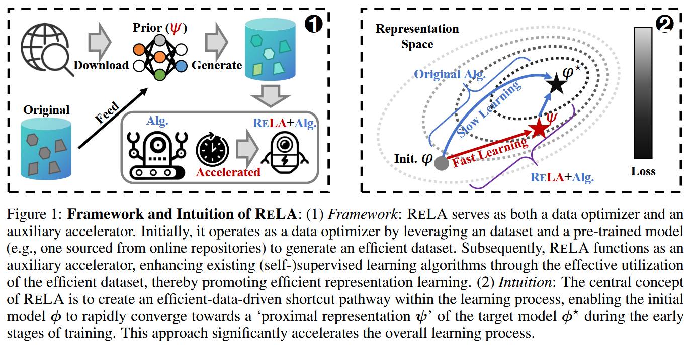

## Intro

现代深度学习范式中大量数据的出现提出了两个基本挑战：
- (i) 对巨大数据集的人工注释的需求消耗了大量的社会资源。
- (ii) 随着数据和模型容量的增加来训练大型模型会承受大量的计算负担。

自监督学习方法通过无需人类标注的自学习范式试图应对挑战(i)，同时也有数据集蒸馏的方法来研究挑战(ii)中的数据效率问题，即模型在蒸馏后的小型数据集上训练的表现近似于在完整数据集上训练得到的模型。

但是这两个挑战仍然存在，并且远远还不能够算是被解决了，本文中确定了以下两个问题：
- (a)、与传统监督学习相比，自监督学习过程效率低下，这是由**sub-optimalself-generating targets**决定的。
- (b)、尽管蒸馏数据集的训练高效且有效，但基于优化的方法的蒸馏过程在计算上要求很高，通常超过了在完整数据集上训练的计算负载。这限制了它加速表示学习的潜力。

基于上述挑战和问题，本文提出问题1：
### Problem 1：Accelerating Representation Learning through Free Models(通过公开模型加速表示学习)

**我们如何利用与任务和架构物件的公开模型来加速特定任务的表示学习？**

为了解决问题1，作者建议RELA利用从互联网下载的免费模型来生成有效的训练数据。这种方法旨在通过有效利用这些生成数据来加速初始阶段的训练，从而建立表示学习的快速路径

作者列举了五个关键贡献，作为将表示学习与数据高效学习联系起来的第一步：
- 揭示有效/低效(自)监督学习的有益/有害属性。作者通过对线性模型的全面分析证明了数据属性据属性通过影响模型训练的优化来显着影响学习过程，对数据的修改可以显著增强或削弱这种优化。此外，他们指出最佳训练需要特定的数据属性，即数据集中样本和目标的完美双射映射
- 以数据为中心的角度识别(自)监督学习的低效率问题。例如现代深度学习中流行的数据增强技术可能会引入“噪声映射”问题，这可能会加剧与低效数据相关的负面影响。
- 有效的数据并不能保证泛化能力，作者提出了泛化边界来分析在此类数据上训练的模型。
- 一种生成和利用有效数据来加速表示学习的方法RELA。
- RELA的应用：加速(自)监督学习。

然后文章从四个角度详细揭示了数据高效学习的关键属性：
- 从以数据为中心的角度统一(自)监督学习
- 以数据为中心的高效学习的实证和理论研究
- 对以数据为中心的高效学习的扩展理解
- 泛化范围内的高效数据合成

这部分建议还是先看原文吧，等我哪天自认为完全理解了再回来写一版。

## Method

### 高效数据集的综合
首先提出了认为各种神经网络架构和算法在不同的现实世界数据集上训练有素的模型(先验模型)会收敛到相同的线性表示空间。实际上就是现有模型对样本生成的伪表示是可以线性传输到彼此以及人类注释目标的。

### 通过生成的高效数据集辅助学习
通过动态的损失调整来调整RELA在训练过程不同阶段的的影响力，同时避免模型过度拟合伪表示。
