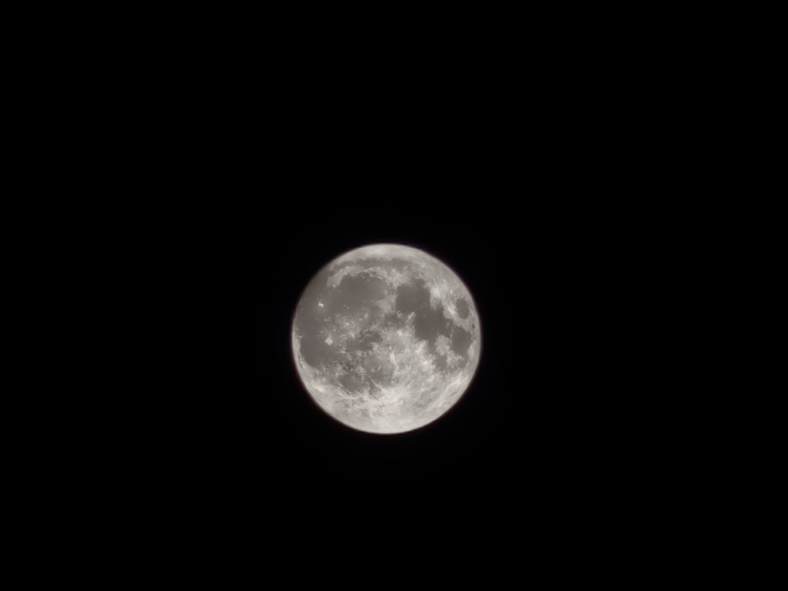

## 写在前面
这篇文章用于记录WWW2025投稿的工作札记和心路历程，同时也设置ddl用于防止自己阶段性开摆。这是我在师先生指导下独自lead的第一个工作，从最开始初入FedGL和Backdoor感觉完全实现不了预期的攻击结果以及没有什么新坑能填，到一点一点优化idea直至好像有一个能看的东西端出来。虽然师先生经常有所鼓励，但说实话WWW可能还是有点太难了。不过哪怕这个工作或许并不能获得世俗意义的认可，但它永远是我本科生涯乃至整个学术生涯浓墨重彩的一笔，是可能多少年以后不再为一两篇顶会发愁，闲暇时刻怅惘的少年意气。

## 9.17
基本上按照预期的week1的计划继续推进，到中秋总算是把abstract改了一版，intro推进到了问题阐释的部分。

下午突然得知晚上十点开会，遂狠狠开卷。直接把之前遗留的关于motivation、definition以及story telling的部分全部理了一遍，而且发现单纯思考paper writing的话散步比对着显示屏思考高效多了，尤其在兴庆湖畔漫步，湖天一色下考虑怎么解释我们自适应trigger和扰动攻击的区别心情还蛮舒畅的，可能这就是work life balance?当然基本前提是基本没课(悲)

晚上简单去游园会品鉴月饼后回来赶工PPT，好在是在开会前做完了。总体上相比于之前师先生能Challenge的地方明显少了，只不过motivation的表述还是要继续优化，目前的讲法还是有比较多的阅读上的误导，容易导致并不流畅的阅读体验(按师先生的说法是读的不“爽”)，关于FedGL分布式后门攻击新的idea评价是能做出来story telling都好说，只要代码能实现的话(楽)。

当前的任务：
- [ ] 把修改的motivation在intro写完
- [ ] 改完intro然后搭一个文章的框架
- [ ] 看看实验能不能继续拆分一下，现在还是有点混在一起

事已至此，先摆一摆，顺带提一下罗神拍得月亮真还不错

## 9.18
把intro部分的motivation写完了，还差我们具体方法的介绍。

## 9.22
稍微摆了两天，不过把intro里面我们的方法、实验结果以及contribution加上去了，自己先改了一版，给罗神看了一遍之后他大概能看懂在干什么，打算找小南梁改一版之后交给师先生看看，之后搭个框架想想后面related work以及method怎么写。同时把对模型在原任务上的影响问题的实验跑完了，发现matplotlib绘图真的好丑(也有可能师我完全不会调各种参数导致的)
