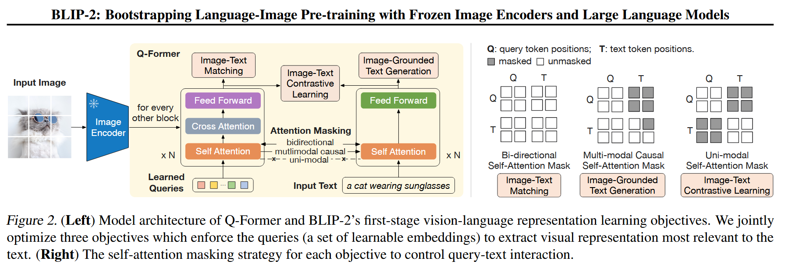

## Intro
本文认为端到端的视觉语言模型训练成本太高了，可以尝试直接利用已有的视觉和语言模型。所以使用预训练的语言和视觉模型可以分别提供强大的语言生成能力、零样本迁移能力和高质量的视觉表示，同时为了降低计算成本和避免灾难性遗忘问题，两种预训练模型在预训练期间都保持冻结状态。

在这个条件下，促进跨模态对齐是关键。由于LLM在预训练期间没有看到过图像，所以在冻结他们的情况下使得视觉与语言对齐是很有挑战性的。一些现有的方法例如Frozen和Flamingo等诉诸尝试使用一种image-to-text generation loss，但这不足以弥补模态差距。

为了使冻结的单个模型能够实现有效的视觉-语言对齐，该文提出了Querying Transformer(Q-Former)。

Q-transformer使一种轻量的transformer，它采用一组可学习的查询向量(learnable query vectors)来从冻结的image encoder中提取视觉特征。它充当冻结的image encoder和LLM之间的信息瓶颈(information bottleneck)，在其中提供最有用的信息。

根据上图可以明显看出有两个阶段，第一个阶段是视觉-语言表示学习(vision-language representation learning)，强制Q-Former学习与文本最相关的视觉表示(有种有目的的蒸馏的感觉?)。第二个阶段，通过Q-Former的输出连接到冻结的LLM来执行视觉到语言的生成学习，并训练Q-Former使其输出的视觉表示能够被LLM解释。

## Method

具体来说，Q-Former从 image encoder中提取固定数量的输出特征，并且与输入图片的分辨率无关。如图2所示，Q-Former由两个共享自注意力层的transformer子模块构成。
- 一个是为了视觉特征提取而与冻结的image encoder交互的image transformer
- 另一个是可以同时作为text encoder和text decoder的text transformer。

### Bootstrap Vision-Language Representation Learning from a Frozen Image Encoder

对于第一个transformer子模块，他们创建一组learnable query embedding来作为image transformer的input。他们的目标是训练Q-Former来查询能够学习提取到最能够提供文本信息的视觉表示。这些查询通过自注意力层相互交互，并通过交叉注意力层与冻结的image features交互。这些查询还能够通过相同的自注意力层与文本进行交互。而根据预训练任务，应当采用不同的自注意力掩码来控制查询文本交互。该文实验自注意力使用了$BERT_{base}$来进行预训练权重初始化，交叉注意力层是随机初始化的。并且需要提醒的是这些查询是被视为模型参数的。具体来说是以下三个部分：
- Image-Text Contrastive Learning (ITC：图文对比学习)，学习对齐图像表示和文本表示，来使得他们的mutual information最大化。它通过对比正类和负类的image-text similarity进行对比来实现这一点。他们将image transformer的输出查询表示$Z$与来自text transformer的文本表示$t$对齐。具体来说是计算了每个查询输出与$t$之间的pairwise similarity，然后选择最高的一个作为image-text similarity。为了避免信息泄露，他们使用了unimodal self-attention mask，其中查询和文本是不能互相看到的。
- Image-grounded Text Generation (ITG：基于图像的文本生成)，由于Q-Former的架构不允许冻结image encoder和text tokens直接交互，因此必须首先通过查询提取提取生成文本所需要的休息，然后通过自注意力层传递给文本标记，然后通过自注意力层传递给text tokens。因此查询被迫提取捕获有关文本的所有信息的视觉特征，在这里他们采用multimodal causal self-attention mask(多模态因果自注意力掩码)来控制查询文本交互。查询可以互相关注，但不能关注text tokens。每个text token可以被连接到所有的查询和先前的text tokens上。
- Image-Text Matching(ITM)，旨在学习图像和文本表示之间的颗粒度对齐。这是一个二分类任务，要求模型预测图像文本对是正还是负，也就是是否匹配。他们在这里使用双向自注意力掩码，其中所有查询和文本都可以相互关注。因此，输出查询嵌入$Z$捕获多模态信息，将每个$Z$输入二分类器获得对应logit，并将其平均作为输出匹配分数。

### Bootstrap Vision-to-Language Generative Learning from a Frozen LLM

在生成预训练阶段，他们将Q-Former连接到冻结的LLM来获得LLM生成语言的能力。如上图所示，通过全连接层将输出查询向量嵌入$Z$投影到与LLM文本嵌入相同的维度，然后将投影的查询嵌入添加到输入文本嵌入之前。他们起到软视觉提示(soft visual prompts)的作用，使LLM以Q-Former提取的视觉表示为条件。在这个过程中Q-Former就类似于一个信息瓶颈，它剔除了原来视觉表示中对于文本的不相关信息，旨在为LLM提供最有用的信息。这减轻了LLN学习视觉-语言对齐的压力，同时也减轻了灾难性的遗忘问题。

